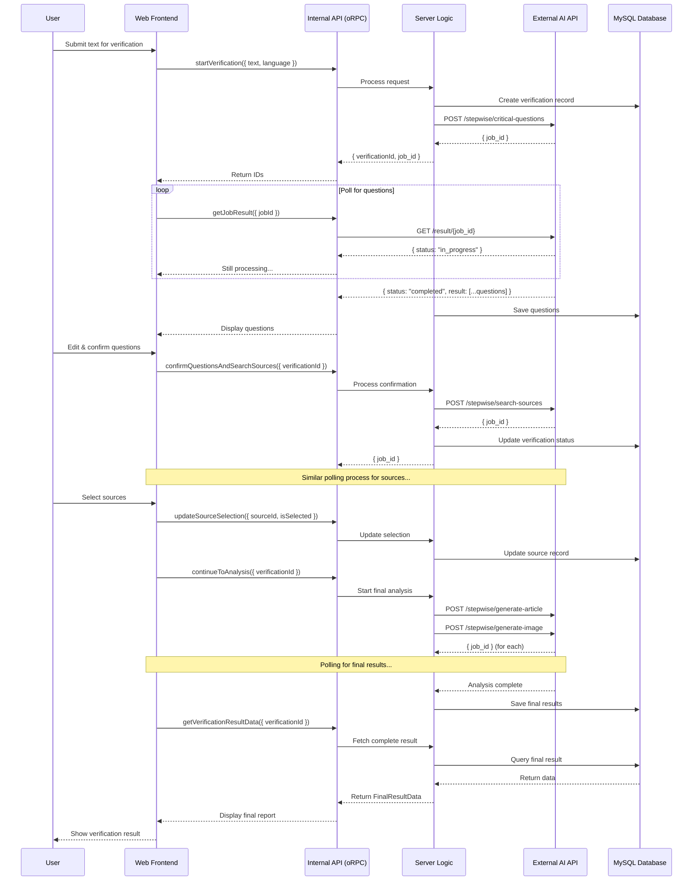

# 🔌 API Documentation

## Overview

This document provides comprehensive documentation for the two primary API interfaces in CheckeApp:

1. **Internal API (oRPC)**: A type-safe API used for all communication between the frontend (`web`) and the backend (`server`).
2. **External API (REST)**: A RESTful AI-powered API developed by Iker, which the backend calls to perform long-running tasks like generating questions, searching sources, and analyzing content.

---

## 🔧 Configuration

### Required Environment Variables

Before using the APIs, configure the following environment variables in `apps/server/.env`:

```env
# Internal API Configuration
RPC_PORT=5000                                    # Port for oRPC server
CORS_ORIGIN=http://localhost:3001              # Frontend origin for CORS
NEXT_PUBLIC_SERVER_URL=http://localhost:3000   # Backend URL (public)
NEXT_PUBLIC_APP_URL=http://localhost:3001      # Frontend URL (public)

# External API Configuration (AI Service)
EXTERNAL_API_BASE_URL=https://your-ai-api-url.com  # Base URL of the external API
EXTERNAL_API_KEY=your_api_key_here                  # API authentication key
EXTERNAL_API_TIMEOUT=30000                          # Request timeout (ms)
MAX_RETRIES=3                                       # Maximum retry attempts
RETRY_DELAY=1000                                    # Delay between retries (ms)
API_MODE=production                                 # API mode: 'production' or 'development'
```

> **Important:** The External API is **required** for fact-checking operations.

### API Client Location

- **Internal API (oRPC)**:

  - Server routers: `apps/server/src/routers/`
  - Client: `apps/web/src/utils/orpc.ts`

- **External API Client**:
  - Implementation: `apps/server/src/lib/externalApiClient.ts`

---

## 1. Internal API (oRPC)

This is the primary API for the application's business logic. It is built using **oRPC**, ensuring end-to-end type safety.

- **Endpoint**: All requests are routed through `/rpc/*`.
- **Implementation**: Defined in `apps/server/src/routers/`.
- **Client**: Consumed by the frontend via the generated client in `apps/web/src/utils/orpc.ts`.

### Key oRPC Procedures

This is not an exhaustive list but covers the main procedures in the verification flow.

| Procedure                          | Router               | Input                      | Output                       | Description                                                                         |
| :--------------------------------- | :------------------- | :------------------------- | :--------------------------- | :---------------------------------------------------------------------------------- |
| `startVerification`                | `verificationRouter` | `{ text, language }`       | `{ verificationId, job_id }` | Creates a verification record and starts the external job to generate questions.    |
| `getJobResult`                     | `verificationRouter` | `{ jobId }`                | `{ status, result }`         | Polls the external API to get the status and result of an asynchronous job.         |
| `getVerificationQuestions`         | `questionRouter`     | `{ verificationId }`       | `Question[]`                 | Fetches the critical questions for a verification.                                  |
| `confirmQuestionsAndSearchSources` | `questionRouter`     | `{ verificationId }`       | `{ jobId }`                  | Confirms user-edited questions and starts the external job to search for sources.   |
| `updateSourceSelection`            | `sourcesRouter`      | `{ sourceId, isSelected }` | `{ success }`                | Updates the selection status of a source.                                           |
| `continueToAnalysis`               | `sourcesRouter`      | `{ verificationId }`       | `{ success }`                | Starts the final asynchronous analysis process (article and image generation).      |
| `getVerificationProgress`          | `verificationRouter` | `{ verificationId }`       | `{ status, hasFinalResult }` | A lightweight polling endpoint for the frontend to check the final analysis status. |
| `getVerificationResultData`        | `verificationRouter` | `{ verificationId }`       | `FinalResultData`            | Fetches the complete, final verification report once it's ready.                    |
| `getCurrentUser`                   | `userRouter`         | `void`                     | `User`                       | Retrieves the authenticated user's profile.                                         |
| `getAllUsers`                      | `adminRouter`        | `void`                     | `User[]`                     | Retrieves all users (Admin only).                                                   |

---

## 2. External API (REST)

The backend communicates with this external, job-based REST API to perform AI tasks. All communication is managed by `apps/server/src/lib/externalApiClient.ts`.

- **Base URL**: `process.env.EXTERNAL_API_BASE_URL`
- **Authentication**: Requires an `X-API-Key` header.

### Asynchronous Job Flow

All `POST` endpoints follow an asynchronous pattern:

1. The backend sends a `POST` request to start a job.
2. The external API immediately responds with a `200 OK` and a `{ job_id }`.
3. The backend (or frontend, via an oRPC procedure) must then poll the `GET /result/{job_id}` endpoint until the `status` is `completed` or `failed`.

### Key External Endpoints

#### `POST /stepwise/critical-questions`

- **Purpose**: Starts a job to generate critical questions from a text.
- **Payload**: `{ "input": string, "model": string, "language": string, "location": string }`
- **Returns**: `{ "job_id": string }`

#### `POST /stepwise/search-sources`

- **Purpose**: Starts a job to find relevant sources based on a list of questions.
- **Payload**: `{ "questions": string[], "input": string, "language": string, "location": string, "model": string }`
- **Returns**: `{ "job_id": string }`

#### `POST /stepwise/generate-article`

- **Purpose**: Starts the final analysis job to generate the fact-checking article.
- **Payload**: `{ "questions": string[], "input": string, "language": string, "location": string, "sources": object[], "model": string }`
- **Returns**: `{ "job_id": string }`

#### `POST /stepwise/generate-image`

- **Purpose**: Starts a job to generate a final image for the verification result.
- **Payload**: `{ "input": string, "model": string, "size": string, "style": string }`
- **Returns**: `{ "job_id": string }`

#### `GET /result/{job_id}`

- **Purpose**: Polls for the result of a previously started job.
- **Returns (In Progress)**: `{ "status": "in_progress", "result": null }`
- **Returns (Completed)**: `{ "status": "completed", "result": { ... } }`
- **Returns (Failed)**: `{ "status": "failed", "error": "Error message" }`

---

## 🔄 Integration Flow

This section illustrates how the two APIs work together in the fact-checking workflow.

### Complete Verification Flow



### Step-by-Step Integration

#### Step 1: Start Verification (oRPC → External API)

**Frontend call:**

```typescript
const { verificationId, job_id } =
  await orpcClient.verification.startVerification.mutate({
    text: "Text to verify...",
    language: "es",
  });
```

**Backend process:**

```typescript
// In verificationRouter.ts
1. Create verification record in database
2. Call externalApiClient.generateCriticalQuestions(text, language)
3. External API returns job_id
4. Return { verificationId, job_id } to frontend
```

**External API call:**

```http
POST https://api.example.com/stepwise/critical-questions
Headers: X-API-Key: your_api_key
Body: {
  "input": "Text to verify...",
  "model": "Latxa-70B",
  "language": "es",
  "location": "Spain"
}
Response: { "job_id": "abc123" }
```

#### Step 2: Poll for Results (oRPC → External API)

**Frontend polling:**

```typescript
const pollForResult = async (jobId: string) => {
  const result = await orpcClient.verification.getJobResult.query({ jobId });

  if (result.status === "in_progress") {
    // Continue polling
    setTimeout(() => pollForResult(jobId), 2000);
  } else if (result.status === "completed") {
    // Process result
    console.log(result.result);
  }
};
```

**Backend process:**

```typescript
// In verificationRouter.ts
1. Receive jobId from frontend
2. Call externalApiClient.pollForResult(jobId)
3. External API returns status and result
4. If completed, save result to database
5. Return status and result to frontend
```

#### Step 3: Continue to Analysis (oRPC → External API)

**Frontend call:**

```typescript
await orpcClient.sources.continueToAnalysis.mutate({
  verificationId: "verification-id",
});
```

**Backend process:**

```typescript
// In sourcesRouter.ts
1. Fetch verification, questions, and selected sources
2. Call externalApiClient.generateArticle(...)
3. Call externalApiClient.generateImage(...)
4. Return success status
5. Frontend polls for completion using getVerificationProgress
```

---

## 🛠️ Development Tips

### Using the Internal API (oRPC)

The oRPC client is automatically typed and provides IntelliSense:

```typescript
// In React components (apps/web)
import { orpc } from "@/utils/orpc";

function MyComponent() {
  // Query (GET-like operation)
  const { data, isLoading } = orpc.user.getCurrentUser.useQuery();

  // Mutation (POST/PUT-like operation)
  const startVerification = orpc.verification.startVerification.useMutation({
    onSuccess: (data) => {
      console.log("Verification started:", data.verificationId);
    },
  });

  return (
    <button
      onClick={() => startVerification.mutate({ text: "...", language: "es" })}
    >
      Start Verification
    </button>
  );
}
```

### Using the External API (from Backend)

The external API client is used exclusively by the backend:

```typescript
// In apps/server/src/db/services/
import { externalApiClient } from "@/lib/externalApiClient";

// Start a job
const jobId = await externalApiClient.generateCriticalQuestions(
  text,
  language,
  model,
  location
);

// Poll for result
const result = await externalApiClient.pollForResult(jobId);

// Handle result
if (result.status === "completed") {
  // Save to database
  await db.insert(criticalQuestions).values(result.questions);
}
```

### Error Handling

Both APIs implement comprehensive error handling:

```typescript
// oRPC automatically wraps errors
try {
  const result = await orpcClient.verification.startVerification.mutate({
    text: "...",
    language: "es",
  });
} catch (error) {
  console.error("Verification failed:", error.message);
}

// External API client includes retry logic
const result = await externalApiClient.generateArticle(
  questions,
  text,
  language,
  sources,
  model
);
// Automatically retries up to MAX_RETRIES times
// Logs errors to process_logs table
```

---

## 🔐 Authentication & Authorization

### Internal API (oRPC)

- **Authentication**: Session-based authentication using Better Auth
- **Authorization**: Permission checks in routers using `verificationsPermissionsService`
- **Session Management**: Automatic session validation on each request

```typescript
// Example: Protected procedure
export const verificationRouter = {
  startVerification: orpc
    .input(startVerificationSchema)
    .use(async (input, context, meta) => {
      // Session is automatically available in context
      if (!context.session) {
        throw new Error("Unauthorized");
      }

      // Continue with business logic
      return meta.next(input);
    })
    .handler(async (input, context) => {
      // User is authenticated here
      const userId = context.session.userId;
      // ...
    }),
};
```

### External API (REST)

- **Authentication**: API Key authentication via `X-API-Key` header
- **Configuration**: Set `EXTERNAL_API_KEY` in environment variables
- **Security**: All requests use HTTPS in production

---

## 📊 API Response Formats

### oRPC Responses

All oRPC responses are type-safe and follow this structure:

```typescript
// Success response
{
  data: T,  // Typed response data
  error: null
}

// Error response
{
  data: null,
  error: {
    message: string,
    code: string,
    details?: any
  }
}
```

### External API Responses

#### Job Creation Response

```json
{
  "job_id": "unique-job-identifier"
}
```

#### Job Result Response (In Progress)

```json
{
  "status": "in_progress",
  "result": null
}
```

#### Job Result Response (Completed)

```json
{
  "status": "completed",
  "result": {
    // Result varies by endpoint
    "questions": [...],
    "sources": [...],
    "article": "...",
    "image_url": "..."
  }
}
```

#### Job Result Response (Failed)

```json
{
  "status": "failed",
  "error": "Error description"
}
```

---

## 🧪 Testing the APIs

### Testing Internal API (oRPC)

You can test oRPC endpoints directly from the frontend:

```typescript
// In browser console or React component
import { orpc } from "@/utils/orpc";

// Test getCurrentUser
const user = await orpc.user.getCurrentUser.query();
console.log(user);

// Test startVerification
const verification = await orpc.verification.startVerification.mutate({
  text: "Test text to verify",
  language: "es",
});
console.log(verification);
```

### Testing External API

The external API is tested through the backend. Use the test file:

```bash
# Create a test file: apps/server/test-external-api.ts
node apps/server/test-external-api.ts
```

Or test directly using the backend router endpoints.

---

## 📚 Additional Resources

- **[Getting Started Guide](./GETTING_STARTED.md)**: Installation and setup
- **[Database Architecture](./DATABASE.md)**: Database schema and relationships
- **[Server Architecture](./SERVER.md)**: Backend structure and services
- **[Verification Process](./VERIFICATION.md)**: Complete fact-checking workflow

---

## 🤝 Support

For API-related issues:

1. Check environment variables configuration
2. Review error logs in `process_logs` table
3. Verify External API connectivity and credentials
4. Consult the team or project administrator

---
