# 📊 Database Architecture Documentation

## Overview

This document provides a comprehensive overview of the CheckeApp database architecture, designed to support a robust fact-checking application with user authentication, verification processes, and detailed audit trails.

## 🏗️ Architecture Principles

The database follows these core principles:

- **Separation of Concerns**: Authentication and fact-checking domains are logically separated
- **Data Integrity**: Comprehensive constraints ensure data quality
- **Performance Optimization**: Strategic indexing for common query patterns
- **Audit Trail**: Complete logging of all verification processes
- **Type Safety**: Full TypeScript integration with Drizzle ORM

---

## 📋 Database Schema Overview

```mermaid

  %%{ init: { "theme": "base", "flowchart": { "curve": "basis" } }}%%

erDiagram
    %% Authentication Domain
    USERS {
        varchar(36) id PK "🔑 Clave Primaria (UUID)"
        text name "👤 Nombre de Usuario"
        varchar(255) email UK "📧 Email Único"
        boolean emailVerified "✅ Estado de Verificación de Email"
        boolean is_verified "👍 Verificado por Admin"
        boolean is_admin "👑 Rol de Administrador"
        boolean termsAccepted "📜 Términos Aceptados"
        text image "🖼️ URL de Imagen de Perfil"
        timestamp createdAt "📅 Fecha de Creación"
        timestamp updatedAt "🔄 Última Actualización"
    }

    SESSIONS {
        varchar_36 id PK "🔑 Primary Key"
        timestamp expires_at "⏰ Session Expiry"
        varchar_255 token "🎫 Unique Token"
        timestamp created_at "📅 Creation Date"
        timestamp updated_at "🔄 Last Update"
        text ip_address "🌐 Client IP"
        text user_agent "💻 Browser Info"
        varchar_36 user_id FK "👤 User Reference"
    }

    ACCOUNTS {
        varchar_36 id PK "🔑 Primary Key"
        text account_id "🆔 OAuth Account ID"
        text provider_id "🔌 OAuth Provider"
        varchar_36 user_id FK "👤 User Reference"
        text access_token "🔐 OAuth Access Token"
        text refresh_token "🔄 OAuth Refresh Token"
        text id_token "🎫 OAuth ID Token"
        timestamp access_token_expires_at "⏰ Token Expiry"
        timestamp refresh_token_expires_at "⏰ Refresh Expiry"
        text scope "📋 OAuth Scope"
        text password "🔒 Hashed Password"
        timestamp created_at "📅 Creation Date"
        timestamp updated_at "🔄 Last Update"
    }

    %% Fact-Checking Domain
    VERIFICATIONS {
        varchar(36) id PK
        varchar(36) user_id FK "👤 Referencia a USER"
        text original_text "📝 Texto a Verificar (10-5000 chars)"
        enum status "🚦 Estado del Proceso"
        enum language "🗣️ Idioma (es, eu, ca, gl)"
        varchar(36) share_token UK "🔗 Token para compartir"
        timestamp created_at
        timestamp updated_at
    }

    CRITICAL_QUESTIONS {
        varchar_36 id PK "🔑 Primary Key"
        varchar_36 verification_id FK "📋 Verification Reference"
        text question_text "❓ Generated Question"
        text original_question "📝 Original Question"
        boolean is_edited "✏️ User Modified"
        int order_index "📊 Display Order"
        timestamp created_at "📅 Creation Date"
    }

    SOURCES {
        varchar_36 id PK "🔑 Primary Key"
        varchar_36 verification_id FK "📋 Verification Reference"
        varchar_2048 url "🔗 Source URL"
        varchar_500 title "📰 Article Title"
        text summary "📄 Content Summary"
        varchar_255 domain "🌐 Domain Name"
        varchar_2048 favicon "🖥️ Icon image"
        boolean is_selected "✅ User Selected"
        timestamp scraping_date "🕷️ Data Scraped"
        timestamp created_at "📅 Creation Date"
    }

    FINAL_RESULTS {
        varchar_36 id PK "🔑 Primary Key"
        varchar_36 verification_id FK "📋 Verification Reference"
        text final_text "📋 Final Analysis"
        varchar(255) image_url "🖼️ URL de Imagen Generada"
        json labels_json "🏷️ Classification Labels"
        json citations_json "📚 Source Citations"
        json answers_json "💬 Question Answers"
        json metadata "📋 Metadata from the model"
        timestamp created_at "📅 Creation Date"
    }

    PROCESS_LOGS {
        varchar_36 id PK "🔑 Primary Key"
        varchar_36 verification_id FK "📋 Verification Reference"
        varchar_100 step "👣 Process Step"
        enum status "🚦 Step Status"
        text error_message "❌ Error Details"
        json api_response "📡 API Response"
        timestamp created_at "📅 Creation Date"
    }

    %% Relationships
    USERS ||--o{ SESSIONS : "has sessions"
    USERS ||--o{ ACCOUNTS : "has oauth accounts"
    USERS ||--o{ VERIFICATIONS : "creates verifications"

    VERIFICATIONS ||--o{ CRITICAL_QUESTIONS : "generates questions"
    VERIFICATIONS ||--o{ SOURCES : "finds sources"
    VERIFICATIONS ||--|| FINAL_RESULTS : "produces result"
    VERIFICATIONS ||--o{ PROCESS_LOGS : "logs process"

```



---

## 🔐 Authentication Domain

### Core Tables

#### **`user`** - Central User Identity

- **Purpose**: Main user account information
- **Key Features**:
  - Email-based authentication with verification
  - Profile information storage
  - Auto-managed timestamps
- **Constraints**: Unique email addresses
- **Indexes**: Email lookup, creation date sorting

#### **`session`** - Active User Sessions

- **Purpose**: Manages user login sessions
- **Key Features**:
  - Token-based session management
  - IP and browser tracking for security
  - Automatic expiration handling
- **Security**: Cascade deletion when user is removed
- **Indexes**: Token lookup, user sessions, expiry cleanup

#### **`account`** - OAuth Provider Accounts

- **Purpose**: Links users to OAuth providers (GitHub, Google, etc.)
- **Key Features**:
  - Multiple OAuth provider support
  - Token refresh management
  - Provider-specific account linking
- **Constraints**: Unique user-provider combinations
- **Security**: Secure token storage

---

### Main Tables

#### **`verifications`** - Main Fact-Check Records

- **Purpose**: Central record for each fact-checking request
- **Status Flow**:

  ```mermaid
  stateDiagram-v2
  [*] --> draft
  draft --> processing_questions
  processing_questions --> sources_ready
  sources_ready --> generating_summary
  generating_summary --> generating_image
  generating_image --> completed
  generating_image --> error

  ```

- **Constraints**: Text length (10-5000 characters)
- **Indexes**: User filtering, status queries, chronological sorting

#### **`critical_questions`** - AI-Generated Questions

- **Purpose**: Stores questions that need to be answered for verification
- **Key Features**:
  - User can edit AI-generated questions
  - Ordered display sequence
  - Track modification history
- **Constraints**:
  - Unique order per verification
  - Question length (5-1000 characters)
  - Non-negative order index
- **Indexes**: Verification lookup, ordered retrieval

#### **`sources`** - Reference Materials

- **Purpose**: Stores sources found for fact-checking
- **Key Features**:
  - URL validation and metadata extraction
  - User source selection
  - Domain-based organization
  - Scraping timestamp tracking
- **Constraints**:
  - URL length limits (2048 characters)
- **Indexes**: Verification lookup, domain filtering, selection status

#### **`final_results`** - Completed Analysis

- **Purpose**: Stores the final fact-check analysis
- **Key Features**:
  - Structured JSON data for labels, citations, answers
  - One result per verification (unique constraint)
  - Rich metadata storage
  - Metadata with aditional information from the API
- **Constraints**:
  - JSON validation for all JSON fields
  - Minimum final text length (10 characters)
  - One-to-one relationship with verifications
- **Indexes**: Verification lookup, creation date

#### **`process_logs`** - Audit Trail

- **Purpose**: Complete audit log of verification process
- **Key Features**:
  - Step-by-step process tracking
  - Error logging with details
  - API response storage for debugging
  - Status tracking (started, completed, error)
- **Constraints**:
  - Error message required for error status
  - Step name length (1-100 characters)
  - Valid JSON for API responses
- **Indexes**: Verification lookup, step/status tracking, chronological

---



```mermaid
erDiagram
    USER ||--o{ VERIFICATION : "crea"
    VERIFICATION ||--o{ CRITICAL_QUESTION : "genera"
    VERIFICATION ||--o{ SOURCE : "busca"
    VERIFICATION ||--o| FINAL_RESULT : "produce"
    VERIFICATION ||--o{ PROCESS_LOG : "registra"

    USER {
        varchar id PK "36 chars, UUID"
        varchar email "Único"
        varchar name
        timestamp created_at
        timestamp updated_at
        boolean is_verified
        boolean is_admin
        boolean termsAccepted
    }

    VERIFICATION {
        varchar id PK "36 chars, UUID"
        varchar user_id FK "Referencias USER"
        text original_text "10-5000 chars"
        enum status "draft, processing_questions, sources_ready, generating_summary, generating_image, completed, error"
        timestamp created_at
        timestamp updated_at
        boolean is_verified
    }

    CRITICAL_QUESTION {
        varchar id PK "36 chars, UUID"
        varchar verification_id FK "Referencias VERIFICATION"
        text question_text "5-200 chars"
        text original_question
        boolean is_edited "Default false"
        int order_index "≥ 0, único por verificación"
        timestamp created_at
    }

    SOURCE {
        varchar id PK "36 chars, UUID"
        varchar verification_id FK "Referencias VERIFICATION"
        varchar url "1-2048 chars, formato HTTP(S)"
        varchar title "≤ 500 chars"
        text summary
        varchar domain "≤ 255 chars"
        varchar favicon "≤ 2048"
        boolean is_selected "Default false"
        timestamp scraping_date
        timestamp created_at
    }

    FINAL_RESULT {
        varchar id PK "36 chars, UUID"
        varchar verification_id FK "Referencias VERIFICATION, único"
        text final_text "≥ 10 chars"
        varchar image_url "≤ 255 chars"
        json labels_json "JSON válido o NULL"
        json citations_json "JSON válido o NULL"
        json answers_json "JSON válido o NULL"
        json metadata "JSON válido o NULL"
        timestamp created_at
    }

    PROCESS_LOG {
        varchar id PK "36 chars, UUID"
        varchar verification_id FK "Referencias VERIFICATION"
        varchar step "1-100 chars"
        enum status "started, completed, error"
        text error_message "Requerido si status = error"
        json api_response "JSON válido o NULL"
        timestamp created_at
    }
```

## 🔗 Relationships and Constraints

### Foreign Key Relationships

```mermaid
graph TD
    U[👤 user] --> S[🎫 session]
    U --> A[🔐 account]
    U --> V[📋 verifications]

    V --> CQ[❓ critical_questions]
    V --> SO[📰 sources]
    V --> FR[📊 final_results]
    V --> PL[📝 process_logs]

    U -.->|CASCADE DELETE| S
    U -.->|CASCADE DELETE| A
    U -.->|CASCADE DELETE| V
    V -.->|CASCADE DELETE| CQ
    V -.->|CASCADE DELETE| SO
    V -.->|CASCADE DELETE| FR
    V -.->|CASCADE DELETE| PL

    style U fill:#e1f5fe
    style V fill:#f3e5f5
    style FR fill:#e8f5e8
```



### Cascade Deletion Strategy

- **User Deletion**: Removes all sessions, accounts, and verifications
- **Verification Deletion**: Removes all related questions, sources, results, and logs
- **Data Integrity**: No orphaned records possible
- **GDPR Compliance**: Complete user data removal

---

## 📊 Performance Optimization

### Indexing Strategy

#### **Primary Performance Indexes**

- **User Operations**: `email`, `created_at`
- **Session Management**: `token`, `user_id`, `expires_at`
- **Verification Queries**: `user_id + status`, `user_id`, `status`
- **Question Ordering**: `verification_id + order_index`
- **Source Filtering**: `verification_id + is_selected`, `domain`
- **Process Monitoring**: `verification_id + step + status`

#### **Composite Indexes for Complex Queries**

```sql
-- Dashboard: User's verifications by status
idx_verifications_user_status(user_id, status)

-- Question ordering within verification
idx_critical_questions_order(verification_id, order_index)

-- Selected sources for verification
idx_sources_is_selected(verification_id, is_selected)

-- Process step tracking
idx_process_logs_step_status(verification_id, step, status)
```

### Query Patterns Optimized

1. **Dashboard Loading**: User's verifications with status filtering
2. **Verification Details**: Full verification with related data
3. **Process Monitoring**: Real-time status updates
4. **Source Selection**: Filtering and selection of sources
5. **Question Management**: Ordered question display and editing

---

## 🛡️ Data Integrity and Validation

### Check Constraints

#### **Text Length Validation**

- Original text: 10-5000 characters
- Questions: 5-1000 characters
- Final text: minimum 10 characters
- Process steps: 1-100 characters

#### **Data Format Validation**

- JSON field validation for all JSON columns
- Non-negative order indexes
- Error message requirements for error status

#### **Business Logic Constraints**

- Unique question ordering per verification
- One final result per verification
- Valid email addresses for users
- Proper OAuth account linking

### Unique Constraints

- **User emails**: Prevents duplicate accounts
- **Session tokens**: Ensures session security
- **Verification order**: Maintains question sequence
- **OAuth accounts**: Prevents duplicate provider links

---

## 🔄 Auto-Managed Fields

### Timestamps

All tables include automatic timestamp management:

- **`created_at`**: Set on record creation (`defaultNow()`)
- **`updated_at`**: Auto-updated on modification (`onUpdateNow()`)

### Default Values

- **Verification status**: Defaults to `'draft'`
- **Question editing**: Defaults to `false`
- **Source selection**: Defaults to `false`
- **Email verification**: Must be explicitly set

---

## 📁 File Structure

```arduino
apps/server/src/db/
├── index.ts                    # Database connection setup
└── schema/
    ├── auth.ts                 # Authentication tables (Better Auth)
    └── factchecker.ts         # Fact-checking domain tables
```

---

## 🔧 Migration and Maintenance

### Database Setup

1. **Install Dependencies**: Drizzle ORM + MySQL2 driver
2. **Environment Configuration**: Database credentials in `.env`
3. **Schema Migration**: Use `drizzle-kit` for migrations
4. **Index Creation**: Automatic via Drizzle schema definition

### Maintenance Tasks

- **Session Cleanup**: Remove expired sessions automatically
- **Verification Cleanup**: Archive old completed verifications
- **Log Rotation**: Manage process log retention
- **Performance Monitoring**: Track query performance and index usage

---
