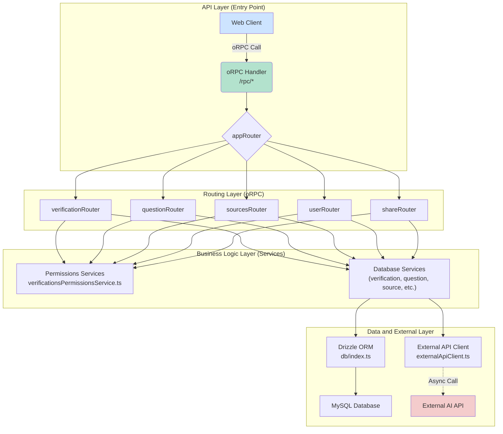

# 🔧 Backend Architecture (`apps/server`)

## Overview

The backend is built as a Next.js application that primarily functions as an API server. It uses oRPC for client communication and an external API client for AI-related tasks.

## Key Features

- **Type-Safe API**: oRPC procedures include input validation (Zod) and end-to-end type safety.
- **Verification Lifecycle**: Full lifecycle management — from record creation to final report generation.
- **Security**:

  - Session-based authentication managed by Better Auth.
  - Resource-level permission control handled by `verificationsPermissionsService.ts`.

- **Asynchronous External Integration**:

  - Communication with the AI API through a centralized client that initiates jobs and manages result polling.
  - Supports development mode (with Mock API) and production mode, configurable via environment variables.

- **Service-Oriented Architecture**: Business logic is encapsulated within services, keeping routers clean and API-focused.
- **Share Capability**: Generates secure tokens for public access to verification results.

## Key Components

### API Layer (`apps/server/src/routers/`)

- **oRPC Routers**: Define API entry points.

  - `verificationRouter.ts`: Starts and manages verifications.
  - `questionRouter.ts`: CRUD operations for critical questions.
  - `sourcesRouter.ts`: Manages sources and orchestrates the final analysis.
  - `userRouter.ts`: Retrieves authenticated user information.
  - `shareRouter.ts`: Handles result-sharing logic.

### Business Logic Layer (`apps/server/src/db/services/`)

- **Database Services**: Encapsulate all database interactions.

  - `verificationService.ts`: Creation and update of verification records.
  - `criticalQuestionService.ts`: Management of critical questions.
  - `sourcesService.ts`: Source management.
  - `finalResultService.ts`: Final analysis orchestration and result storage.
  - `verificationsPermissionsService.ts`: Centralized access control logic for resources.

### Integration Layer

- **External API Client (`apps/server/src/lib/externalApiClient.ts`)**:

  - Single communication point with the AI API.
  - Includes retry logic, process logging (`process_logs`), and job polling (`pollForResult`).

### Data Layer

- **Drizzle Schema (`apps/server/src/db/schema/`)**:

  - Defines the database structure as TypeScript code.
  - Enables automatic generation of SQL migrations.
