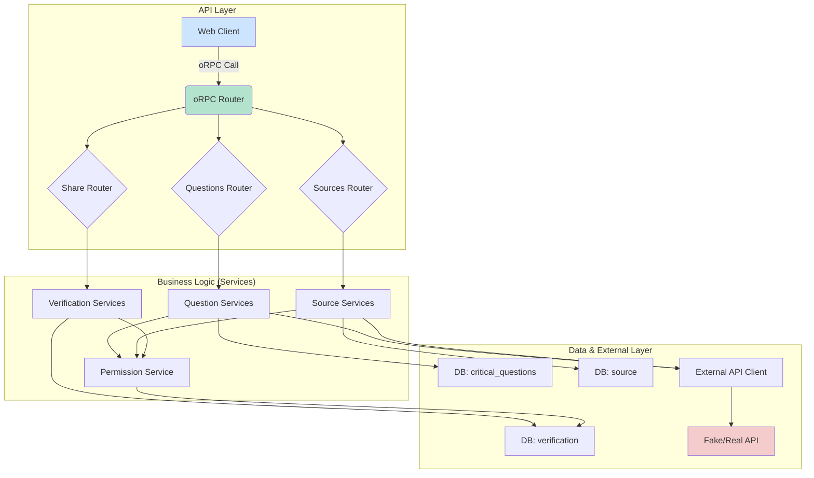

## Features

- **End-to-End Typed API**: Type-safe oRPC procedures with input validation and output types.
- **Verification Lifecycle**: Complete process management from initial record to final report.
- **Security**:
  - Authentication via Better Auth
  - User permissions control through verificationsPermissionsService.ts
- **External Integration**:
  - API communication for AI tasks
  - Supports both real and simulated (Fake API) modes
- **Database Management**:
  - Encapsulated database interactions
  - Service-based architecture
- **Sharing Capability**: Generates secure public access tokens for verification results

## Key Components

### API Layer (apps/server/src/routers/)

- **oRPC Routers**: Define API entry points
  - `questionRouter.ts`: CRUD operations for critical questions
  - `sourcesRouter.ts`: Source management and analysis
  - `shareRouter.ts`: Result sharing logic

### Business Logic (apps/server/src/db/services/)

- **Database Services**:
  - `verificationService.ts`: Verification record management
  - `criticalQuestionService.ts`: Question management
  - `sourcesService.ts`: Source management
  - `finalsResultService.ts`: Analysis orchestration
  - `verificationsPermissionsService.ts`: Permission control

### Integration Layer

- **External API Client** (`apps/server/src/lib/externalApiClient.ts`):
  - Manages external API communication
  - Supports dev/prod modes
  - Includes retry logic and logging

### Data Layer

- **Drizzle Schema** (`apps/server/src/db/schema/`):
  - Code-first database structure
  - Auto-generated migrations
  - Type-safe queries

### System Interconnections

- **Frontend**: oRPC endpoint with CORS protection
- **Database**: Drizzle ORM connection
- **External API**: Configurable HTTP client
