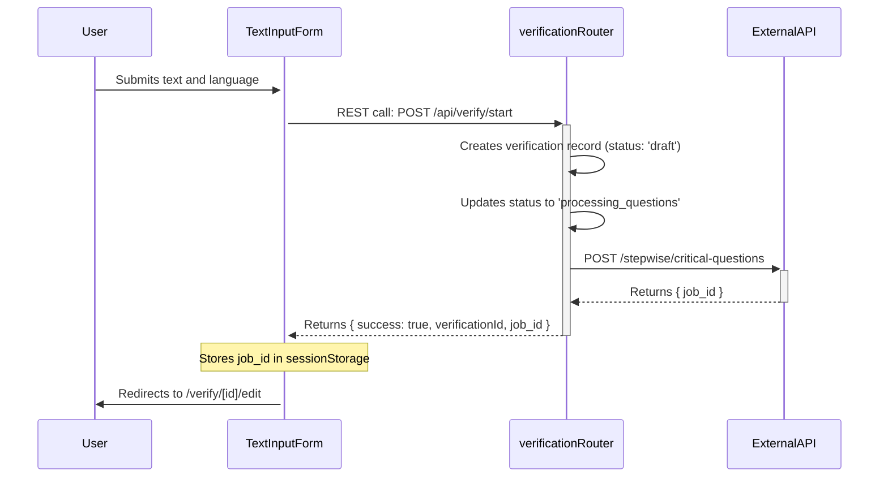
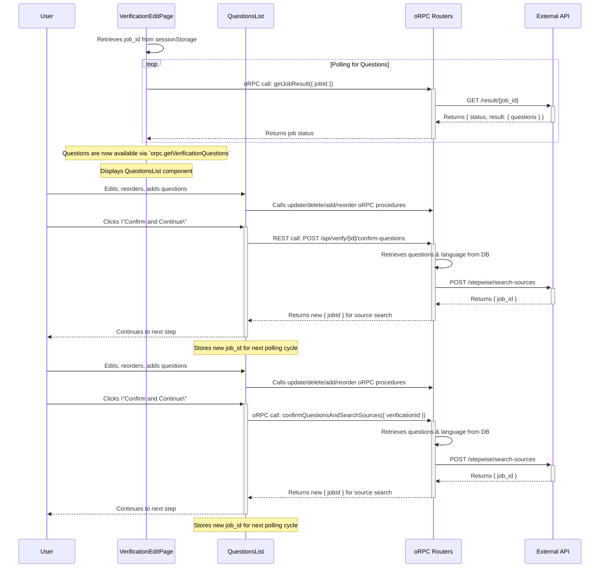
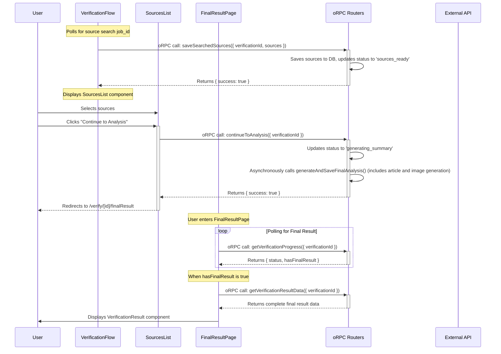

# 🔄 Verification Flow Architecture

## Overview

This document describes the complete, asynchronous, multi-step flow for a fact-checking request in the CheckeApp. The architecture is designed to handle long-running AI tasks without blocking the user interface.

The process is orchestrated by the frontend, which initiates jobs on the backend and polls for their results.

---

## 📊 The 4-Step Verification Process

1. **📝 Text Submission & Question Generation**: The user submits text. The backend starts a job to generate questions.
2. **❓ Question Editing & Source Search**: The user edits the questions. When confirmed, the backend starts a job to find sources.
3. **🔗 Source Selection & Final Analysis**: The user selects sources. When confirmed, the backend starts the final, long-running analysis job (article and image generation).
4. **📊 Result Display**: The user is redirected to a results page that polls for the final report.

---

## 🚀 Step 1: Text Submission & Question Generation

**Goal**: Initiate a verification and get the initial set of AI-generated questions.

### Implementation Details: Step 1

#### Frontend (`TextInputForm.tsx`)

- Calls the `startVerification` oRPC procedure, passing the user's text and the selected `locale`.
- On success, it receives a `verificationId` and a `job_id`.
- It stores the `job_id` in `sessionStorage` (e.g., `verification_job_<verificationId>`) to pass it to the next page.
- Redirects the user to the edit page (`/verify/[verificationId]/edit`).

#### Backend (`apps/server/src/app/api/verify/start/route.ts`)

- The `startVerification` procedure creates a `verification` record in the database with the provided language and an initial status.
- It immediately calls the external API to start the question generation job.
- It **does not wait** for the job to finish. It returns the `job_id` to the frontend right away.

---

## ❓ Step 2: Question Editing & Source Search

**Goal**: Fetch the generated questions, allow the user to edit them, and then kick off the source-searching job.

### Implementation Details: Step 2

#### Frontend (`VerificationEditPage.tsx`)

- Retrieves the `job_id` from `sessionStorage`.
- Uses `useQuery` with a `refetchInterval` to poll the `getJobResult` oRPC procedure.
- Once the job is completed, the frontend calls `orpc.saveSearchedSources` (if it was a source job) or relies on the backend to have saved the questions (if it was a question job).
- The `QuestionsList` component then fetches the saved questions using `getVerificationQuestions`.

#### Frontend (`QuestionsList.tsx`)

- Allows the user to perform CRUD operations on the questions.
- When the user clicks "Confirm", it calls the `confirmQuestionsAndSearchSources` mutation.

#### Backend (`apps/server/src/app/api/verify/[id]/confirm-questions.ts`)

- This is a REST API route, not an oRPC procedure.
- It retrieves the final set of questions and the verification's language from the database.
- It calls the external API's `/stepwise/search-sources` endpoint.
- It returns a new `job_id` to the frontend for the source-searching task.

---

## 🔗 Step 3 & 4: Source Selection, Final Analysis & Result Display

**Goal**: Fetch sources, allow user selection, start the final analysis, and display the result. This flow is nearly identical to the previous step.

### Implementation Details: Steps 3 & 4

#### Frontend (`VerificationFlow.tsx`)

- Manages the polling for the source search `job_id`.
- On completion, calls `saveSearchedSources`.
- The `SourcesList` component fetches and displays the sources.
- When the user confirms, it calls the `continueToAnalysis` mutation.

#### Backend (`sourcesRouter.ts`)

- `continueToAnalysis` updates the verification status to `generating_summary` and asynchronously (without awaiting) calls `generateAndSaveFinalAnalysis`. This function orchestrates both article and image generation jobs. It immediately returns success to the frontend.

#### Frontend (`FinalResultPage.tsx`)

- This page does not poll `getVerificationResultData` directly.
- It polls the lightweight `getVerificationProgress` endpoint.
- When `getVerificationProgress` returns `hasFinalResult: true`, the polling stops, and a final `useQuery` for `getVerificationResultData` is enabled to fetch the complete report just once.
