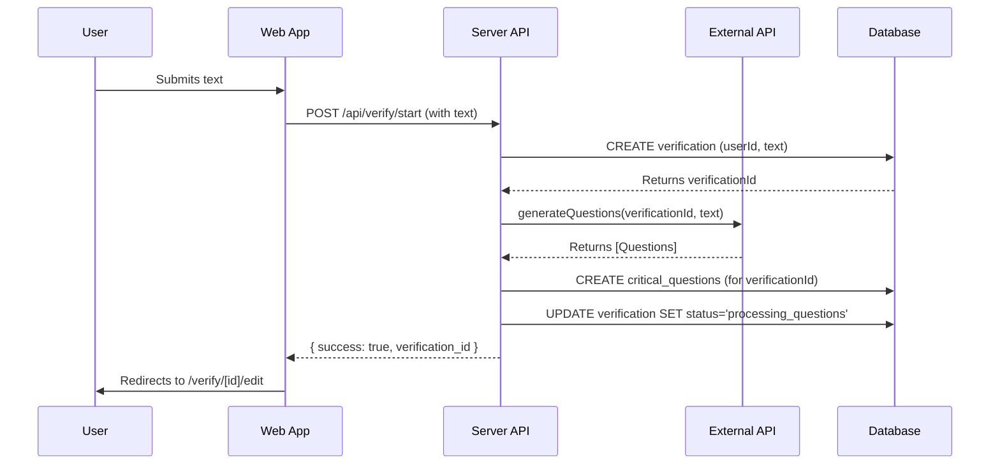
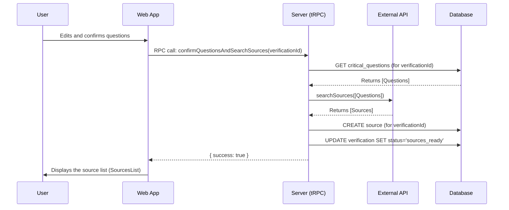
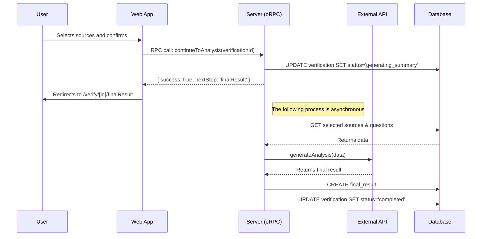
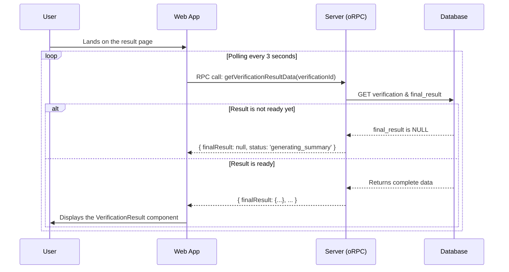

# 🔄 Application Flow & Architecture

This document describes the complete flow of the FactCheckerProject application, from text submission to displaying the final verification result.

---

## 📊 Overview

The application follows a **4-step verification process**:

1. 📝 **Text Submission** - User enters text to verify
2. ❓ **Question Generation & Editing** - AI generates questions, user reviews/edits
3. 🔗 **Source Selection** - Backend finds sources, user selects relevant ones
4. 📊 **Final Analysis** - AI analyzes and displays results

---

## 🚀 Step 1: Text Submission & Question Generation

The user submits text for verification, and the system generates critical questions.

### Sequence Diagram

### Implementation Details

#### Frontend

- The TextInputForm makes a POST request to the server's ORPC
- Text is submitted through the form
- Response includes verificationId and generated questions
- User is redirected to Step 2

#### Backend

- The route creates a verification record
- Calls the externalApiClient to generate questions
- Saves questions to the critical_questions table
- Updates the verification status to questions_ready

#### Key Files

- apps/web/src/components/TextInputForm.tsx
- apps/server/src/app/api/verify/start/route.ts

## ❓ Step 2: Question Confirmation & Source Search

The user reviews, edits, and finally confirms the questions.

### Sequence Diagram

### Implementation Details

#### Frontend

- The QuestionsList component handles the edits
- Users can add, edit, delete, and reorder questions
- Clicking "Confirm" triggers the searchSourcesMutation in VerificationFlow
- Mutation executes the tRPC procedure

#### Backend

- The questionRouter receives the call
- Gets the final questions from the database
- Calls the externalApiClient to search for sources
- Saves received sources to the source table
- Updates the status to sources_ready

#### Key Files

- apps/web/src/components/QuestionsList.tsx
- apps/web/src/components/VerificationFlow.tsx
- apps/server/src/routers/questionRouter.ts

## 🔗 Step 3: Source Selection & Analysis Initiation

The user selects the most relevant sources and proceeds to the final analysis.

### Implementation Details

#### Frontend

- The SourcesList component manages the selection
- Upon confirmation, VerificationFlow calls the continueToAnalysisMutation
- Mutation executes the oRPC procedure
- User is redirected to the results page

#### Backend

- The sourcesRouter receives the call
- Updates status to generating_summary
- Returns response to client
- Asynchronously starts generateAndSaveFinalAnalysis process

Step 4: Viewing the Final Result
The results page polls the server until the analysis is complete.

## Frontend and Backend Polling Implementation

### Frontend: `finalResult/page.tsx`

The `finalResult/page.tsx` page uses `useQuery` from **TanStack Query** with a `refetchInterval` to poll the `getVerificationResultData` procedure.

### Backend: `sourcesRouter`

The `sourcesRouter` responds to each poll with the current status. Once the asynchronous process from Step 3 has created the record in `final_results`, the next polling call will return the complete data, and the frontend will stop polling.