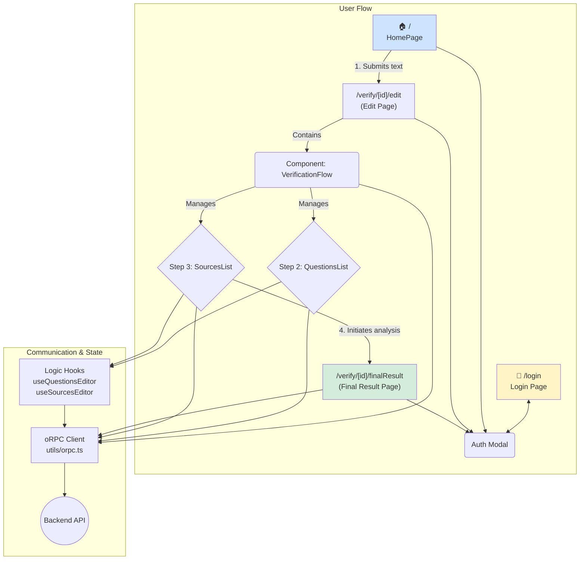

# 🎨 Frontend Architecture (`apps/web`)

## Overview

The frontend is a Single-Page Application (SPA) built with Next.js and the App Router, designed to provide a smooth, guided user experience throughout the fact-checking process.

## Key Features

- **Guided Verification Flow**: A multi-step interface (`VerificationFlow.tsx`) that guides the user from text submission to receiving the final result.
- **Non-Intrusive Authentication**: An authentication modal (`AuthModal.tsx`) shown only when an action requires an account.
- **Real-time Editing**: Users can edit, add, or reorder questions with optimistic UI updates managed by `useQuestionsEditor.ts`.
- **Source Management**: Interface for searching, filtering, and selecting sources, handled by `useSourcesEditor.ts`.
- **Result Visualization**: Dedicated page (`VerificationResult.tsx`) to display the final verdict, with Markdown support and citations.
- **Result Sharing**: Generates a unique public link (`/share/[token]`) for sharing results.
- **Internationalization (i18n)**: Full multilingual support (Spanish, Basque, Catalan, Galician) via `react-intl` and an `I18nProvider`.
- **Global Loading Feedback**: A global loader (`GlobalLoader.tsx`) automatically displayed during key asynchronous operations.

## Key Components & Hooks

| Element                  | Description                                                                       |
| ------------------------ | --------------------------------------------------------------------------------- |
| `VerificationFlow.tsx`   | Orchestrates the process, managing state between the questions and sources steps. |
| `TextInputForm.tsx`      | Form on the homepage for text submission.                                         |
| `QuestionsList.tsx`      | Component for CRUD and reordering of verification questions.                      |
| `SourcesList.tsx`        | Component for managing and selecting sources.                                     |
| `VerificationResult.tsx` | Displays the final formatted report with interactive citations.                   |
| `useQuestionsEditor.ts`  | Hook encapsulating state logic and mutations for questions.                       |
| `useSourcesEditor.ts`    | Hook managing the logic for searching, filtering, and selecting sources.          |

## Technical Architecture

### Frontend Technology Stack

- **Framework**: Next.js 14 with App Router
- **UI Components**: `shadcn/ui` built on Radix UI and Tailwind CSS
- **Server State Management**: TanStack Query for data fetching, caching, and mutations
- **Form Handling**: `@tanstack/react-form` with Zod validation (types inferred from the backend)

### Interconnections

#### Backend Communication

- Communication is handled exclusively through an oRPC client (`/utils/orpc.ts`).
- Uses `@orpc/tanstack-query` to generate strongly typed TanStack Query hooks from backend procedures, ensuring end-to-end type safety.

#### State Management

- **Server State**: TanStack Query is the source of truth for all backend-derived data (verifications, questions, sources).
- **Global Client State**: React Context (`LoadingProvider`, `I18nProvider`) handles global states like loading indicators and current language.
- **Local State**: `useState` manages component-level state (e.g., input contents, modal visibility).

#### Browser Data Persistence

- **`sessionStorage`**: Temporarily stores the `job_id` between verification creation and the edit page.
- **`localStorage`**: Saves the user’s language preference.
- **Cookies (`httpOnly`)**: Used by Better Auth to securely manage the session token.
