```mermaid
graph TD
    subgraph "User Navigation"
        A[🏠 Home Page] -->|Submits text| B(Component: VerificationFlow);
        B --> C{Step 2: QuestionsList};
        C -->|Confirms Questions| D{Step 3: SourcesList};
        D -->|Confirms Sources| E[📊 FinalResult Page];
        F[👤 Login Page] --> A;
        A --> F;
    end

    subgraph "Backend Communication"
        B --> G[oRPC Client];
        C --> G;
        D --> G;
        E --> G;
    end

    style A fill:#cde4ff
    style F fill:#fff4c5
    style E fill:#d4edda
```

## Features

- **Guided Verification Flow**: A multi-step interface that guides the user from submitting text to receiving a final result.
- **User Authentication**: Integrated registration and login forms, with modals that appear when authentication is required to perform an action.
- **Real-time Editing**: Users can edit, add, delete, and reorder verification questions with the interface updating immediately.
- **Source Management**: An interface for searching, filtering, and selecting the sources to be used in the final analysis.
- **Result Visualization**: A dedicated, well-structured page to display the final verdict, detailed answers, citations, and the sources used.
- **Result Sharing**: Generation of a unique, public link to share the results of a verification with unauthenticated users.
- **Internationalization (i18n)**: Support for multiple languages (Spanish, Basque, Catalan, Galician) throughout the entire UI.

## Key Components

Our web application consists of several core components:

| Component                | Description                                                                |
| ------------------------ | -------------------------------------------------------------------------- |
| `VerificationFlow.tsx`   | Orchestrates the verification process, managing state and step transitions |
| `TextInputForm.tsx`      | Homepage form component for text submission with authentication checks     |
| `QuestionsList.tsx`      | Step 2 component for CRUD operations on verification questions             |
| `SourcesList.tsx`        | Step 3 component for source management and selection                       |
| `VerificationResult.tsx` | Final report display with verdict, analysis, and citations                 |

### Authentication Components

- `AuthGuard.tsx`: Route protection
- `AuthModal.tsx`: Login/registration modal
- `SignInForm.tsx`: User login form
- `SignUpForm.tsx`: New user registration

### Custom Hooks

- `useQuestionsEditor.ts`: Questions management logic
- `useSourcesEditor.ts`: Sources handling and API integration

## Technical Architecture

### Frontend Technology Stack

- **Framework**: Next.js 14 with App Router
- **UI Components**: Shadcn/ui + Tailwind CSS
- **State Management**: TanStack Query + React Context
- **Form Handling**: React Hook Form + Zod

---

### Interconnection

#### Backend Communication

- Exclusive communication via oRPC Client (`apps/web/src/utils/orpc.ts`)
- TanStack Query hooks for fully typed data exchange
- Automated type-safety between frontend and backend

#### State Management

- **Server State**: TanStack Query for:
  - Data caching
  - Automatic revalidation
  - Optimistic updates
  - Data mutations

#### Data Persistence

- `sessionStorage`: Temporary verification text storage
- `localStorage`: User language preferences
- JWT tokens: Authentication state management

---
